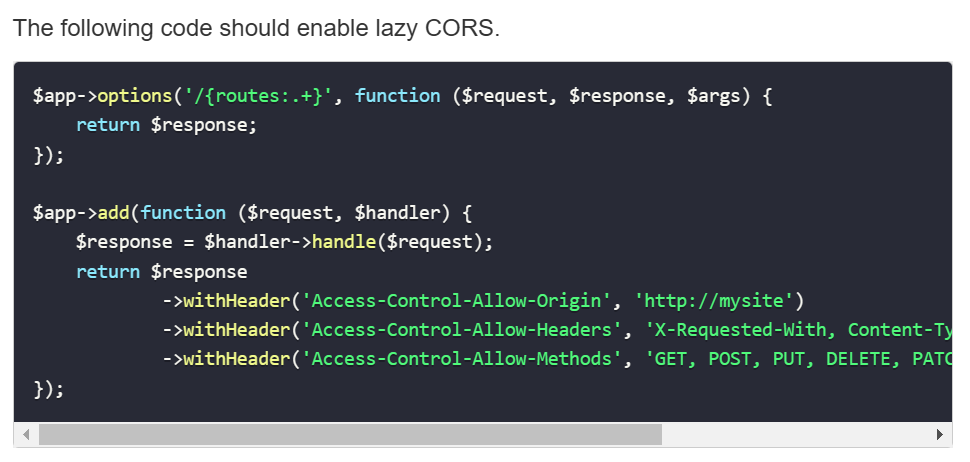

inmobiliaria-

Segundo proyecto de la materia seminario de lenguajes\
**Realizado por:** Gabriel Miranda y Santiago Álvarez.

## Modificaciones en API

-   **Arreglo CORS:** La configuración de CORS establecida en la API no permitía
    realizar algunas acciones como PUT, por lo que se agregó un middleware
    inicial que resuelve este error. Esto estaba en la documentación de Slim.
    

-   **Populación:** Hay algunas páginas en las que se necesita saber información
    sobre los recursos relacionados a un recurso en particular, como el nombre
    de la localidad de una propiedad, o el domicilio de una propiedad en una
    reserva. En estos casos lo que hicimos fué modificar los endpoints para
    pedir a la base de datos esta información y reemplazarla por el campo de id.
    La función llamada "obtenerDeTabla" es útil en este caso, ya que con ella
    podemos elegir los campos que vamos a requerir, lo cual nos evita devolver
    campos no deseados, como la imagen de una propiedad cuando esta no va a ser
    usada.\
    En el endpoint específico de obtener propiedad, se implementó un parametro de
    url "populado" con el cual se puede decidir si se quiere popular el resultado.
    Esto es útil porque en la app usamos las dos formas, populada para mostrarla
    y no populada para el formulario.

-   **Tipo de campo "imagen" en propiedades:** Lo que queremos almacenar en este
    campo es una imagen en formato base64. El tipo establecido previamente en la
    base de datos era 'text', el cual no puede almacenar la suficiente
    información, por lo cual el tipo se cambió a 'mediumtext'.

-   **Nuevos endpoints:** necesitábamos nuevos endpoints para obtener un tipo de
    propiedad, localidad, y reserva específicos, para usarlos en los formularios
    de editar.

-   **Modificaciones menores:** múltiples cambios menores como retocar
    validaciones, cambio de nombres en valores de respuesta, y los errores
    marcados en la corrección del proyecto anterior, entre otros.
